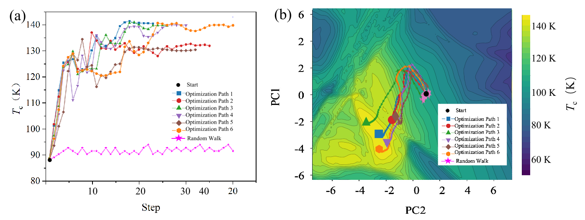

## Inverse Design of Superconductors using a Diffusion Model and Simulated Gradient Drift

This project aims to design high-temperature superconductors using a diffusion generative model combined with a simulated gradient drift technique. By operating within the continuous latent space of the diffusion model and incorporating gradient drift guided by a predictive model, we efficiently explore the composition space and generate candidate superconductors with higher critical temperatures ($T_c$).

### Architecture Diagram


### Project Background

Traditional methods for designing high-temperature superconductors rely on high-throughput experiments, which are time-consuming and resource-intensive. While machine learning (ML) methods can learn structure-property relationships, ML-based forward search methods are inefficient when exploring the vast space of possible composition combinations. This project proposes a novel approach that integrates a diffusion generative model with simulated gradient drift to overcome these limitations.

### Method Overview

1. **Diffusion Generative Model:** A pre-trained variational autoencoder (VAE) encodes superconductor into a continuous latent space. A diffusion model then denoises samples generated by the VAE.

2. **Simulated Gradient Drift:** Small, random perturbations are applied to the vector representing the input superconductor in the latent space, simulating compositional changes. A pre-trained predictive model (based on a CNN) predicts the $T_c$ value for each perturbed vector. The difference in $T_c$ between the original and perturbed superconductor is used to calculate a gradient in the latent space. This gradient indicates the direction in which the latent vector should be moved to increase the $T_c$ of the generated superconductor.

3. **Iterative Optimization:** By iteratively perturbing the latent vector and updating it based on the calculated gradients, the model effectively "drifts" towards regions of the latent space associated with higher-$T_c$ superconductors.

### Code Structure

* `vae.py`: Defines the VAE model, the chemical formula dataset class, and functions for encoding/decoding chemical formulas.
* `diffusion.py`: Defines the diffusion model, which denoises samples generated by the VAE.
* `grad_guided_optimization.py`: Implements the simulated gradient drift and optimization process, including gradient estimation, optimization loop, and visualization functions.
* `readme.md`: Project documentation (this file).


### Key Code Snippets

```python:grad_guided_optimization.py
vae = VAE(in_channels=3, latent_dim=20, n_feat=256).to(device)
vae=torch.load("vae_model.pth")
vae.eval()
```

Loads the pre-trained VAE model.

```python:grad_guided_optimization.py
def estimate_gradient_mic(self, z, q, beta, batch_size=1):
    ...
    return grads / q
```

Estimates the gradient in the latent space.

```python:grad_guided_optimization.py
def perform_optimization(vae, p, z_0, attempts=30, learning_rate=0.1):
    ...
    return traj_z, traj_tc, z.clone().detach().cpu().numpy()
```

Performs the gradient-guided optimization process.


### Results and Discussion

This approach effectively increased the average critical temperature of generated superconductors to 120 K and identified 20 new potential high-$T_c$ superconductors with $T_c$ values exceeding 140 K, the highest of which reaches 148.11 K.


### Future Work

* Explore different gradient estimation methods.
* Optimize hyperparameters to improve performance.
* Extend the approach to other material systems.


